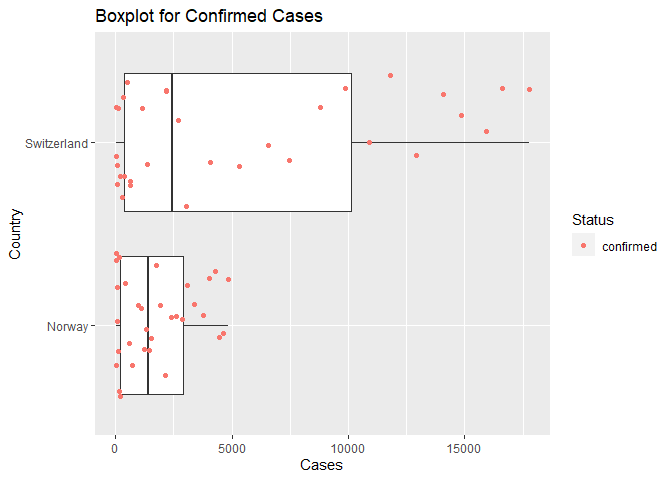

-   [Interacting with API’s Vignette: Example with the Covid19
    API.](#interacting-with-apis-vignette-example-with-the-covid19-api)
    -   [Packages Required](#packages-required)

# Interacting with API’s Vignette: Example with the Covid19 API.

This vignette will go through the steps of reading and summarizing data
from an API. We will utilize the Covid19 API.

## Packages Required

The following packages were used to utilize the functions needed for
interacting with the API and manipulating the retrieved data:  
\* `httr`: Used to retrieve data from APIs.  
\* `jsonlite`: Functions used to manipulate JSON data.  
\* `tidyverse`: Functions used to get manipulate and reshape data.

``` r
library(httr)
library(jsonlite)
library(tidyverse)
library(dplyr)
```

### Accessing the Data

First we will access data from the API regarding confirmed Covid 19
Cases for Norway and Switzerland during the time frame from March 1,
2020 - April 1, 2020 for comparison. This will be achieved using the GET
function from the `httr` package to return information from the API.

``` r
getCountry <- GET("https://api.covid19api.com/country/Switzerland/status/confirmed?from=2020-03-01T00:00:00Z&to=2020-04-01T00:00:00Z")

getCountry2 <- GET("https://api.covid19api.com/country/Norway/status/confirmed?from=2020-03-01T00:00:00Z&to=2020-04-01T00:00:00Z")

getCountry
```

    ## Response [https://api.covid19api.com/country/Switzerland/status/confirmed?from=2020-03-01T00:00:00Z&to=2020-04-01T00:00:00Z]
    ##   Date: 2021-10-01 21:55
    ##   Status: 200
    ##   Content-Type: application/json; charset=UTF-8
    ##   Size: 5.56 kB
    ## [{"Country":"Switzerland","CountryCode":"CH","Province":"","City":"","CityCode...

``` r
getCountry2
```

    ## Response [https://api.covid19api.com/country/Norway/status/confirmed?from=2020-03-01T00:00:00Z&to=2020-04-01T00:00:00Z]
    ##   Date: 2021-10-01 21:55
    ##   Status: 200
    ##   Content-Type: application/json; charset=UTF-8
    ##   Size: 5.39 kB
    ## [{"Country":"Norway","CountryCode":"NO","Province":"","City":"","CityCode":"",...

We will now review the contents of the returned data. The content
function with the text parameter converts the raw data to JSON.

``` r
getCountryText <- content(getCountry, "text")
getCountryText2 <- content(getCountry2, "text")
getCountryText
```

    ## [1] "[{\"Country\":\"Switzerland\",\"CountryCode\":\"CH\",\"Province\":\"\",\"City\":\"\",\"CityCode\":\"\",\"Lat\":\"46.82\",\"Lon\":\"8.23\",\"Cases\":27,\"Status\":\"confirmed\",\"Date\":\"2020-03-01T00:00:00Z\"},{\"Country\":\"Switzerland\",\"CountryCode\":\"CH\",\"Province\":\"\",\"City\":\"\",\"CityCode\":\"\",\"Lat\":\"46.82\",\"Lon\":\"8.23\",\"Cases\":42,\"Status\":\"confirmed\",\"Date\":\"2020-03-02T00:00:00Z\"},{\"Country\":\"Switzerland\",\"CountryCode\":\"CH\",\"Province\":\"\",\"City\":\"\",\"CityCode\":\"\",\"Lat\":\"46.82\",\"Lon\":\"8.23\",\"Cases\":56,\"Status\":\"confirmed\",\"Date\":\"2020-03-03T00:00:00Z\"},{\"Country\":\"Switzerland\",\"CountryCode\":\"CH\",\"Province\":\"\",\"City\":\"\",\"CityCode\":\"\",\"Lat\":\"46.82\",\"Lon\":\"8.23\",\"Cases\":90,\"Status\":\"confirmed\",\"Date\":\"2020-03-04T00:00:00Z\"},{\"Country\":\"Switzerland\",\"CountryCode\":\"CH\",\"Province\":\"\",\"City\":\"\",\"CityCode\":\"\",\"Lat\":\"46.82\",\"Lon\":\"8.23\",\"Cases\":114,\"Status\":\"confirmed\",\"Date\":\"2020-03-05T00:00:00Z\"},{\"Country\":\"Switzerland\",\"CountryCode\":\"CH\",\"Province\":\"\",\"City\":\"\",\"CityCode\":\"\",\"Lat\":\"46.82\",\"Lon\":\"8.23\",\"Cases\":214,\"Status\":\"confirmed\",\"Date\":\"2020-03-06T00:00:00Z\"},{\"Country\":\"Switzerland\",\"CountryCode\":\"CH\",\"Province\":\"\",\"City\":\"\",\"CityCode\":\"\",\"Lat\":\"46.82\",\"Lon\":\"8.23\",\"Cases\":268,\"Status\":\"confirmed\",\"Date\":\"2020-03-07T00:00:00Z\"},{\"Country\":\"Switzerland\",\"CountryCode\":\"CH\",\"Province\":\"\",\"City\":\"\",\"CityCode\":\"\",\"Lat\":\"46.82\",\"Lon\":\"8.23\",\"Cases\":337,\"Status\":\"confirmed\",\"Date\":\"2020-03-08T00:00:00Z\"},{\"Country\":\"Switzerland\",\"CountryCode\":\"CH\",\"Province\":\"\",\"City\":\"\",\"CityCode\":\"\",\"Lat\":\"46.82\",\"Lon\":\"8.23\",\"Cases\":374,\"Status\":\"confirmed\",\"Date\":\"2020-03-09T00:00:00Z\"},{\"Country\":\"Switzerland\",\"CountryCode\":\"CH\",\"Province\":\"\",\"City\":\"\",\"CityCode\":\"\",\"Lat\":\"46.82\",\"Lon\":\"8.23\",\"Cases\":491,\"Status\":\"confirmed\",\"Date\":\"2020-03-10T00:00:00Z\"},{\"Country\":\"Switzerland\",\"CountryCode\":\"CH\",\"Province\":\"\",\"City\":\"\",\"CityCode\":\"\",\"Lat\":\"46.82\",\"Lon\":\"8.23\",\"Cases\":652,\"Status\":\"confirmed\",\"Date\":\"2020-03-11T00:00:00Z\"},{\"Country\":\"Switzerland\",\"CountryCode\":\"CH\",\"Province\":\"\",\"City\":\"\",\"CityCode\":\"\",\"Lat\":\"46.82\",\"Lon\":\"8.23\",\"Cases\":652,\"Status\":\"confirmed\",\"Date\":\"2020-03-12T00:00:00Z\"},{\"Country\":\"Switzerland\",\"CountryCode\":\"CH\",\"Province\":\"\",\"City\":\"\",\"CityCode\":\"\",\"Lat\":\"46.82\",\"Lon\":\"8.23\",\"Cases\":1139,\"Status\":\"confirmed\",\"Date\":\"2020-03-13T00:00:00Z\"},{\"Country\":\"Switzerland\",\"CountryCode\":\"CH\",\"Province\":\"\",\"City\":\"\",\"CityCode\":\"\",\"Lat\":\"46.82\",\"Lon\":\"8.23\",\"Cases\":1359,\"Status\":\"confirmed\",\"Date\":\"2020-03-14T00:00:00Z\"},{\"Country\":\"Switzerland\",\"CountryCode\":\"CH\",\"Province\":\"\",\"City\":\"\",\"CityCode\":\"\",\"Lat\":\"46.82\",\"Lon\":\"8.23\",\"Cases\":2200,\"Status\":\"confirmed\",\"Date\":\"2020-03-15T00:00:00Z\"},{\"Country\":\"Switzerland\",\"CountryCode\":\"CH\",\"Province\":\"\",\"City\":\"\",\"CityCode\":\"\",\"Lat\":\"46.82\",\"Lon\":\"8.23\",\"Cases\":2200,\"Status\":\"confirmed\",\"Date\":\"2020-03-16T00:00:00Z\"},{\"Country\":\"Switzerland\",\"CountryCode\":\"CH\",\"Province\":\"\",\"City\":\"\",\"CityCode\":\"\",\"Lat\":\"46.82\",\"Lon\":\"8.23\",\"Cases\":2700,\"Status\":\"confirmed\",\"Date\":\"2020-03-17T00:00:00Z\"},{\"Country\":\"Switzerland\",\"CountryCode\":\"CH\",\"Province\":\"\",\"City\":\"\",\"CityCode\":\"\",\"Lat\":\"46.82\",\"Lon\":\"8.23\",\"Cases\":3028,\"Status\":\"confirmed\",\"Date\":\"2020-03-18T00:00:00Z\"},{\"Country\":\"Switzerland\",\"CountryCode\":\"CH\",\"Province\":\"\",\"City\":\"\",\"CityCode\":\"\",\"Lat\":\"46.82\",\"Lon\":\"8.23\",\"Cases\":4075,\"Status\":\"confirmed\",\"Date\":\"2020-03-19T00:00:00Z\"},{\"Country\":\"Switzerland\",\"CountryCode\":\"CH\",\"Province\":\"\",\"City\":\"\",\"CityCode\":\"\",\"Lat\":\"46.82\",\"Lon\":\"8.23\",\"Cases\":5294,\"Status\":\"confirmed\",\"Date\":\"2020-03-20T00:00:00Z\"},{\"Country\":\"Switzerland\",\"CountryCode\":\"CH\",\"Province\":\"\",\"City\":\"\",\"CityCode\":\"\",\"Lat\":\"46.82\",\"Lon\":\"8.23\",\"Cases\":6575,\"Status\":\"confirmed\",\"Date\":\"2020-03-21T00:00:00Z\"},{\"Country\":\"Switzerland\",\"CountryCode\":\"CH\",\"Province\":\"\",\"City\":\"\",\"CityCode\":\"\",\"Lat\":\"46.82\",\"Lon\":\"8.23\",\"Cases\":7474,\"Status\":\"confirmed\",\"Date\":\"2020-03-22T00:00:00Z\"},{\"Country\":\"Switzerland\",\"CountryCode\":\"CH\",\"Province\":\"\",\"City\":\"\",\"CityCode\":\"\",\"Lat\":\"46.82\",\"Lon\":\"8.23\",\"Cases\":8795,\"Status\":\"confirmed\",\"Date\":\"2020-03-23T00:00:00Z\"},{\"Country\":\"Switzerland\",\"CountryCode\":\"CH\",\"Province\":\"\",\"City\":\"\",\"CityCode\":\"\",\"Lat\":\"46.82\",\"Lon\":\"8.23\",\"Cases\":9877,\"Status\":\"confirmed\",\"Date\":\"2020-03-24T00:00:00Z\"},{\"Country\":\"Switzerland\",\"CountryCode\":\"CH\",\"Province\":\"\",\"City\":\"\",\"CityCode\":\"\",\"Lat\":\"46.82\",\"Lon\":\"8.23\",\"Cases\":10897,\"Status\":\"confirmed\",\"Date\":\"2020-03-25T00:00:00Z\"},{\"Country\":\"Switzerland\",\"CountryCode\":\"CH\",\"Province\":\"\",\"City\":\"\",\"CityCode\":\"\",\"Lat\":\"46.82\",\"Lon\":\"8.23\",\"Cases\":11811,\"Status\":\"confirmed\",\"Date\":\"2020-03-26T00:00:00Z\"},{\"Country\":\"Switzerland\",\"CountryCode\":\"CH\",\"Province\":\"\",\"City\":\"\",\"CityCode\":\"\",\"Lat\":\"46.82\",\"Lon\":\"8.23\",\"Cases\":12928,\"Status\":\"confirmed\",\"Date\":\"2020-03-27T00:00:00Z\"},{\"Country\":\"Switzerland\",\"CountryCode\":\"CH\",\"Province\":\"\",\"City\":\"\",\"CityCode\":\"\",\"Lat\":\"46.82\",\"Lon\":\"8.23\",\"Cases\":14076,\"Status\":\"confirmed\",\"Date\":\"2020-03-28T00:00:00Z\"},{\"Country\":\"Switzerland\",\"CountryCode\":\"CH\",\"Province\":\"\",\"City\":\"\",\"CityCode\":\"\",\"Lat\":\"46.82\",\"Lon\":\"8.23\",\"Cases\":14829,\"Status\":\"confirmed\",\"Date\":\"2020-03-29T00:00:00Z\"},{\"Country\":\"Switzerland\",\"CountryCode\":\"CH\",\"Province\":\"\",\"City\":\"\",\"CityCode\":\"\",\"Lat\":\"46.82\",\"Lon\":\"8.23\",\"Cases\":15922,\"Status\":\"confirmed\",\"Date\":\"2020-03-30T00:00:00Z\"},{\"Country\":\"Switzerland\",\"CountryCode\":\"CH\",\"Province\":\"\",\"City\":\"\",\"CityCode\":\"\",\"Lat\":\"46.82\",\"Lon\":\"8.23\",\"Cases\":16605,\"Status\":\"confirmed\",\"Date\":\"2020-03-31T00:00:00Z\"},{\"Country\":\"Switzerland\",\"CountryCode\":\"CH\",\"Province\":\"\",\"City\":\"\",\"CityCode\":\"\",\"Lat\":\"46.82\",\"Lon\":\"8.23\",\"Cases\":17768,\"Status\":\"confirmed\",\"Date\":\"2020-04-01T00:00:00Z\"}]\n"

``` r
getCountryText2
```

    ## [1] "[{\"Country\":\"Norway\",\"CountryCode\":\"NO\",\"Province\":\"\",\"City\":\"\",\"CityCode\":\"\",\"Lat\":\"60.47\",\"Lon\":\"8.47\",\"Cases\":19,\"Status\":\"confirmed\",\"Date\":\"2020-03-01T00:00:00Z\"},{\"Country\":\"Norway\",\"CountryCode\":\"NO\",\"Province\":\"\",\"City\":\"\",\"CityCode\":\"\",\"Lat\":\"60.47\",\"Lon\":\"8.47\",\"Cases\":25,\"Status\":\"confirmed\",\"Date\":\"2020-03-02T00:00:00Z\"},{\"Country\":\"Norway\",\"CountryCode\":\"NO\",\"Province\":\"\",\"City\":\"\",\"CityCode\":\"\",\"Lat\":\"60.47\",\"Lon\":\"8.47\",\"Cases\":32,\"Status\":\"confirmed\",\"Date\":\"2020-03-03T00:00:00Z\"},{\"Country\":\"Norway\",\"CountryCode\":\"NO\",\"Province\":\"\",\"City\":\"\",\"CityCode\":\"\",\"Lat\":\"60.47\",\"Lon\":\"8.47\",\"Cases\":56,\"Status\":\"confirmed\",\"Date\":\"2020-03-04T00:00:00Z\"},{\"Country\":\"Norway\",\"CountryCode\":\"NO\",\"Province\":\"\",\"City\":\"\",\"CityCode\":\"\",\"Lat\":\"60.47\",\"Lon\":\"8.47\",\"Cases\":87,\"Status\":\"confirmed\",\"Date\":\"2020-03-05T00:00:00Z\"},{\"Country\":\"Norway\",\"CountryCode\":\"NO\",\"Province\":\"\",\"City\":\"\",\"CityCode\":\"\",\"Lat\":\"60.47\",\"Lon\":\"8.47\",\"Cases\":108,\"Status\":\"confirmed\",\"Date\":\"2020-03-06T00:00:00Z\"},{\"Country\":\"Norway\",\"CountryCode\":\"NO\",\"Province\":\"\",\"City\":\"\",\"CityCode\":\"\",\"Lat\":\"60.47\",\"Lon\":\"8.47\",\"Cases\":147,\"Status\":\"confirmed\",\"Date\":\"2020-03-07T00:00:00Z\"},{\"Country\":\"Norway\",\"CountryCode\":\"NO\",\"Province\":\"\",\"City\":\"\",\"CityCode\":\"\",\"Lat\":\"60.47\",\"Lon\":\"8.47\",\"Cases\":176,\"Status\":\"confirmed\",\"Date\":\"2020-03-08T00:00:00Z\"},{\"Country\":\"Norway\",\"CountryCode\":\"NO\",\"Province\":\"\",\"City\":\"\",\"CityCode\":\"\",\"Lat\":\"60.47\",\"Lon\":\"8.47\",\"Cases\":205,\"Status\":\"confirmed\",\"Date\":\"2020-03-09T00:00:00Z\"},{\"Country\":\"Norway\",\"CountryCode\":\"NO\",\"Province\":\"\",\"City\":\"\",\"CityCode\":\"\",\"Lat\":\"60.47\",\"Lon\":\"8.47\",\"Cases\":400,\"Status\":\"confirmed\",\"Date\":\"2020-03-10T00:00:00Z\"},{\"Country\":\"Norway\",\"CountryCode\":\"NO\",\"Province\":\"\",\"City\":\"\",\"CityCode\":\"\",\"Lat\":\"60.47\",\"Lon\":\"8.47\",\"Cases\":598,\"Status\":\"confirmed\",\"Date\":\"2020-03-11T00:00:00Z\"},{\"Country\":\"Norway\",\"CountryCode\":\"NO\",\"Province\":\"\",\"City\":\"\",\"CityCode\":\"\",\"Lat\":\"60.47\",\"Lon\":\"8.47\",\"Cases\":702,\"Status\":\"confirmed\",\"Date\":\"2020-03-12T00:00:00Z\"},{\"Country\":\"Norway\",\"CountryCode\":\"NO\",\"Province\":\"\",\"City\":\"\",\"CityCode\":\"\",\"Lat\":\"60.47\",\"Lon\":\"8.47\",\"Cases\":996,\"Status\":\"confirmed\",\"Date\":\"2020-03-13T00:00:00Z\"},{\"Country\":\"Norway\",\"CountryCode\":\"NO\",\"Province\":\"\",\"City\":\"\",\"CityCode\":\"\",\"Lat\":\"60.47\",\"Lon\":\"8.47\",\"Cases\":1090,\"Status\":\"confirmed\",\"Date\":\"2020-03-14T00:00:00Z\"},{\"Country\":\"Norway\",\"CountryCode\":\"NO\",\"Province\":\"\",\"City\":\"\",\"CityCode\":\"\",\"Lat\":\"60.47\",\"Lon\":\"8.47\",\"Cases\":1221,\"Status\":\"confirmed\",\"Date\":\"2020-03-15T00:00:00Z\"},{\"Country\":\"Norway\",\"CountryCode\":\"NO\",\"Province\":\"\",\"City\":\"\",\"CityCode\":\"\",\"Lat\":\"60.47\",\"Lon\":\"8.47\",\"Cases\":1333,\"Status\":\"confirmed\",\"Date\":\"2020-03-16T00:00:00Z\"},{\"Country\":\"Norway\",\"CountryCode\":\"NO\",\"Province\":\"\",\"City\":\"\",\"CityCode\":\"\",\"Lat\":\"60.47\",\"Lon\":\"8.47\",\"Cases\":1463,\"Status\":\"confirmed\",\"Date\":\"2020-03-17T00:00:00Z\"},{\"Country\":\"Norway\",\"CountryCode\":\"NO\",\"Province\":\"\",\"City\":\"\",\"CityCode\":\"\",\"Lat\":\"60.47\",\"Lon\":\"8.47\",\"Cases\":1550,\"Status\":\"confirmed\",\"Date\":\"2020-03-18T00:00:00Z\"},{\"Country\":\"Norway\",\"CountryCode\":\"NO\",\"Province\":\"\",\"City\":\"\",\"CityCode\":\"\",\"Lat\":\"60.47\",\"Lon\":\"8.47\",\"Cases\":1746,\"Status\":\"confirmed\",\"Date\":\"2020-03-19T00:00:00Z\"},{\"Country\":\"Norway\",\"CountryCode\":\"NO\",\"Province\":\"\",\"City\":\"\",\"CityCode\":\"\",\"Lat\":\"60.47\",\"Lon\":\"8.47\",\"Cases\":1914,\"Status\":\"confirmed\",\"Date\":\"2020-03-20T00:00:00Z\"},{\"Country\":\"Norway\",\"CountryCode\":\"NO\",\"Province\":\"\",\"City\":\"\",\"CityCode\":\"\",\"Lat\":\"60.47\",\"Lon\":\"8.47\",\"Cases\":2118,\"Status\":\"confirmed\",\"Date\":\"2020-03-21T00:00:00Z\"},{\"Country\":\"Norway\",\"CountryCode\":\"NO\",\"Province\":\"\",\"City\":\"\",\"CityCode\":\"\",\"Lat\":\"60.47\",\"Lon\":\"8.47\",\"Cases\":2385,\"Status\":\"confirmed\",\"Date\":\"2020-03-22T00:00:00Z\"},{\"Country\":\"Norway\",\"CountryCode\":\"NO\",\"Province\":\"\",\"City\":\"\",\"CityCode\":\"\",\"Lat\":\"60.47\",\"Lon\":\"8.47\",\"Cases\":2621,\"Status\":\"confirmed\",\"Date\":\"2020-03-23T00:00:00Z\"},{\"Country\":\"Norway\",\"CountryCode\":\"NO\",\"Province\":\"\",\"City\":\"\",\"CityCode\":\"\",\"Lat\":\"60.47\",\"Lon\":\"8.47\",\"Cases\":2863,\"Status\":\"confirmed\",\"Date\":\"2020-03-24T00:00:00Z\"},{\"Country\":\"Norway\",\"CountryCode\":\"NO\",\"Province\":\"\",\"City\":\"\",\"CityCode\":\"\",\"Lat\":\"60.47\",\"Lon\":\"8.47\",\"Cases\":3084,\"Status\":\"confirmed\",\"Date\":\"2020-03-25T00:00:00Z\"},{\"Country\":\"Norway\",\"CountryCode\":\"NO\",\"Province\":\"\",\"City\":\"\",\"CityCode\":\"\",\"Lat\":\"60.47\",\"Lon\":\"8.47\",\"Cases\":3369,\"Status\":\"confirmed\",\"Date\":\"2020-03-26T00:00:00Z\"},{\"Country\":\"Norway\",\"CountryCode\":\"NO\",\"Province\":\"\",\"City\":\"\",\"CityCode\":\"\",\"Lat\":\"60.47\",\"Lon\":\"8.47\",\"Cases\":3755,\"Status\":\"confirmed\",\"Date\":\"2020-03-27T00:00:00Z\"},{\"Country\":\"Norway\",\"CountryCode\":\"NO\",\"Province\":\"\",\"City\":\"\",\"CityCode\":\"\",\"Lat\":\"60.47\",\"Lon\":\"8.47\",\"Cases\":4015,\"Status\":\"confirmed\",\"Date\":\"2020-03-28T00:00:00Z\"},{\"Country\":\"Norway\",\"CountryCode\":\"NO\",\"Province\":\"\",\"City\":\"\",\"CityCode\":\"\",\"Lat\":\"60.47\",\"Lon\":\"8.47\",\"Cases\":4284,\"Status\":\"confirmed\",\"Date\":\"2020-03-29T00:00:00Z\"},{\"Country\":\"Norway\",\"CountryCode\":\"NO\",\"Province\":\"\",\"City\":\"\",\"CityCode\":\"\",\"Lat\":\"60.47\",\"Lon\":\"8.47\",\"Cases\":4445,\"Status\":\"confirmed\",\"Date\":\"2020-03-30T00:00:00Z\"},{\"Country\":\"Norway\",\"CountryCode\":\"NO\",\"Province\":\"\",\"City\":\"\",\"CityCode\":\"\",\"Lat\":\"60.47\",\"Lon\":\"8.47\",\"Cases\":4641,\"Status\":\"confirmed\",\"Date\":\"2020-03-31T00:00:00Z\"},{\"Country\":\"Norway\",\"CountryCode\":\"NO\",\"Province\":\"\",\"City\":\"\",\"CityCode\":\"\",\"Lat\":\"60.47\",\"Lon\":\"8.47\",\"Cases\":4863,\"Status\":\"confirmed\",\"Date\":\"2020-04-01T00:00:00Z\"}]\n"

We will now covert the raw data into JSON format which will allow us to
PARSE the data and output a data frame using the jsonlite package that
was previously installed.

``` r
getCountryJs <- fromJSON(getCountryText, flatten = TRUE)
getCountryJs2 <- fromJSON(getCountryText2, flatten = TRUE)
```

We will convert the parsed JSON data for Norway & Switzerland into a
tibble for our analysis.

``` r
getCountryJsTb <- as_tibble(getCountryJs)
getCountryJsTb
```

    ## # A tibble: 32 x 10
    ##    Country     CountryCode Province City  CityCode Lat   Lon   Cases Status Date 
    ##    <chr>       <chr>       <chr>    <chr> <chr>    <chr> <chr> <int> <chr>  <chr>
    ##  1 Switzerland CH          ""       ""    ""       46.82 8.23     27 confi~ 2020~
    ##  2 Switzerland CH          ""       ""    ""       46.82 8.23     42 confi~ 2020~
    ##  3 Switzerland CH          ""       ""    ""       46.82 8.23     56 confi~ 2020~
    ##  4 Switzerland CH          ""       ""    ""       46.82 8.23     90 confi~ 2020~
    ##  5 Switzerland CH          ""       ""    ""       46.82 8.23    114 confi~ 2020~
    ##  6 Switzerland CH          ""       ""    ""       46.82 8.23    214 confi~ 2020~
    ##  7 Switzerland CH          ""       ""    ""       46.82 8.23    268 confi~ 2020~
    ##  8 Switzerland CH          ""       ""    ""       46.82 8.23    337 confi~ 2020~
    ##  9 Switzerland CH          ""       ""    ""       46.82 8.23    374 confi~ 2020~
    ## 10 Switzerland CH          ""       ""    ""       46.82 8.23    491 confi~ 2020~
    ## # ... with 22 more rows

``` r
getCountryJs2Tb <- as_tibble(getCountryJs2)
getCountryJs2Tb
```

    ## # A tibble: 32 x 10
    ##    Country CountryCode Province City  CityCode Lat   Lon   Cases Status    Date  
    ##    <chr>   <chr>       <chr>    <chr> <chr>    <chr> <chr> <int> <chr>     <chr> 
    ##  1 Norway  NO          ""       ""    ""       60.47 8.47     19 confirmed 2020-~
    ##  2 Norway  NO          ""       ""    ""       60.47 8.47     25 confirmed 2020-~
    ##  3 Norway  NO          ""       ""    ""       60.47 8.47     32 confirmed 2020-~
    ##  4 Norway  NO          ""       ""    ""       60.47 8.47     56 confirmed 2020-~
    ##  5 Norway  NO          ""       ""    ""       60.47 8.47     87 confirmed 2020-~
    ##  6 Norway  NO          ""       ""    ""       60.47 8.47    108 confirmed 2020-~
    ##  7 Norway  NO          ""       ""    ""       60.47 8.47    147 confirmed 2020-~
    ##  8 Norway  NO          ""       ""    ""       60.47 8.47    176 confirmed 2020-~
    ##  9 Norway  NO          ""       ""    ""       60.47 8.47    205 confirmed 2020-~
    ## 10 Norway  NO          ""       ""    ""       60.47 8.47    400 confirmed 2020-~
    ## # ... with 22 more rows

We will now combine the data for Norway and Switzerland into one data
frame using the rbind function and remove the empty columns Province,
City, & CityCode.

``` r
NorSwiz <- function(df1, df2) {rbind(df1, df2)}
Combo <- NorSwiz(df1 = getCountryJsTb, df2 = getCountryJs2Tb)
Combo$Province <- NULL
Combo$City <- NULL
Combo$CityCode <- NULL
Combo
```

    ## # A tibble: 64 x 7
    ##    Country     CountryCode Lat   Lon   Cases Status    Date                
    ##    <chr>       <chr>       <chr> <chr> <int> <chr>     <chr>               
    ##  1 Switzerland CH          46.82 8.23     27 confirmed 2020-03-01T00:00:00Z
    ##  2 Switzerland CH          46.82 8.23     42 confirmed 2020-03-02T00:00:00Z
    ##  3 Switzerland CH          46.82 8.23     56 confirmed 2020-03-03T00:00:00Z
    ##  4 Switzerland CH          46.82 8.23     90 confirmed 2020-03-04T00:00:00Z
    ##  5 Switzerland CH          46.82 8.23    114 confirmed 2020-03-05T00:00:00Z
    ##  6 Switzerland CH          46.82 8.23    214 confirmed 2020-03-06T00:00:00Z
    ##  7 Switzerland CH          46.82 8.23    268 confirmed 2020-03-07T00:00:00Z
    ##  8 Switzerland CH          46.82 8.23    337 confirmed 2020-03-08T00:00:00Z
    ##  9 Switzerland CH          46.82 8.23    374 confirmed 2020-03-09T00:00:00Z
    ## 10 Switzerland CH          46.82 8.23    491 confirmed 2020-03-10T00:00:00Z
    ## # ... with 54 more rows

We will create a contingency table that shows the occurrences of
confirmed cases between March - April 2020. Each country had a confirmed
case during this time frame.

``` r
x <- c('Country')
y <- c('Status')
TwoWay <- function(x, y){
  tbl <- table(Combo[[x]], Combo[[y]])
return(tbl)}
TwoWay(x = "Country", y = "Status")
```

    ##              
    ##               confirmed
    ##   Norway             32
    ##   Switzerland        32

Below is a box plot representing confirmed cases in Norway and
Switzerland between March - April 2020. The output shows that
Switzerland had a higher number of confirmed cases.

``` r
x <- c("Cases")
y <- c("Country")
Cases <- function(.data, x, y){
ggplot(.data, aes(x = .data[[x]], y = .data[[y]])) +
geom_boxplot() + geom_jitter(aes(color = Status)) + ggtitle("Boxplot for Confirmed Cases")}
Cases(.data = Combo, x = "Cases", y = "Country")
```

<!-- -->
