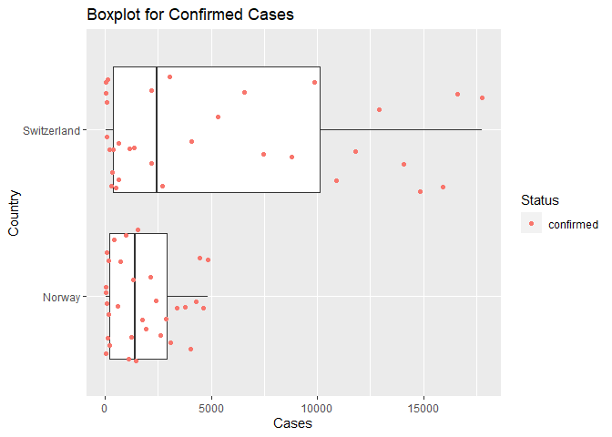
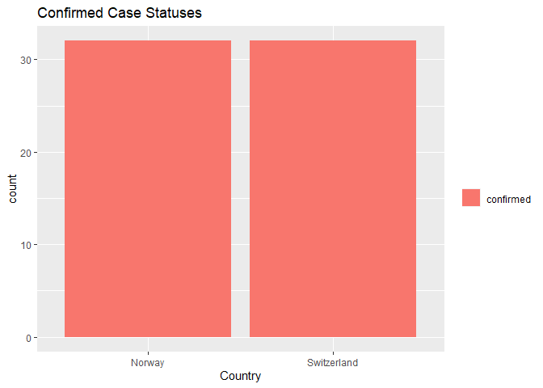
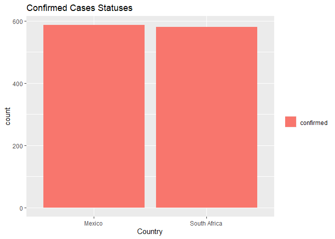
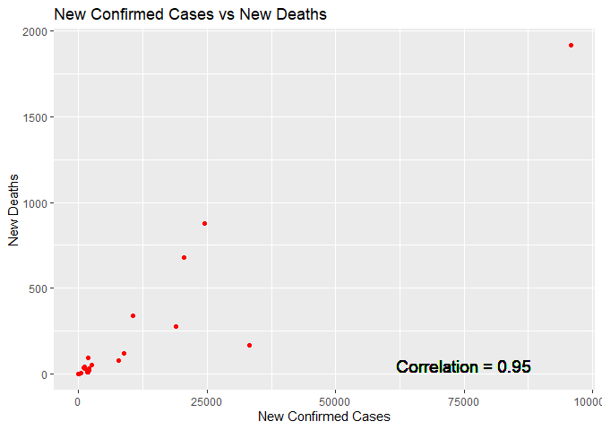
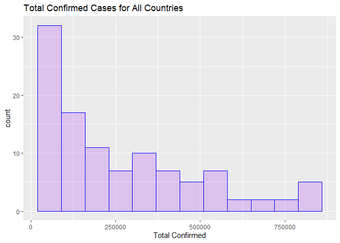

Covid19 API Vignette
================
Chennade Brown
10/05/2021

-   [Introduction](#introduction)
-   [Packages Required](#packages-required)
-   [Accessing the Data](#accessing-the-data)
-   [Data Analysis](#data-analysis)
-   [Conclusion](#conclusion)

# Introduction

This vignette will go through the steps of reading and summarizing data
from an API. We will utilize the Covid19 API.

# Packages Required

The following packages were used to utilize the functions needed for
interacting with the API and manipulating the retrieved data:  
\* `httr`: Used to retrieve data from APIs.  
\* `jsonlite`: Functions used to manipulate JSON data.  
\* `tidyverse`: Functions used to manipulate and reshape data.  
\* `dplyr`: Function that contains a set of tools for manipulating data
in R.

``` r
library(httr)
library(jsonlite)
library(tidyverse)
library(dplyr)
```

# Accessing the Data

First we will access data from the API regarding confirmed Covid19 cases
for Norway and Switzerland during the time frame from March 1, 2020 -
April 1, 2020 for comparison. This will be achieved using the GET
function from the `httr` package to return information from the API.

``` r
getCountry <- GET("https://api.covid19api.com/country/Switzerland/status/confirmed?from=2020-03-01T00:00:00Z&to=2020-04-01T00:00:00Z")

getCountry2 <- GET("https://api.covid19api.com/country/Norway/status/confirmed?from=2020-03-01T00:00:00Z&to=2020-04-01T00:00:00Z")
```

We will now review the contents of the returned data. The content
function with the text parameter converts the raw data to JSON.

``` r
getCountryText <- content(getCountry, "text")
getCountryText2 <- content(getCountry2, "text")
```

We will now covert the raw data into JSON format which will allow us to
parse the data and output a data frame using the jsonlite package.

``` r
getCountryJs <- fromJSON(getCountryText, flatten = TRUE)
getCountryJs2 <- fromJSON(getCountryText2, flatten = TRUE)
```

We will convert the parsed JSON data for Norway & Switzerland into a
tibble for our analysis.

``` r
getCountryJsTb <- as_tibble(getCountryJs)
```

``` r
getCountryJs2Tb <- as_tibble(getCountryJs2)
```

We will now combine the data for Norway and Switzerland into one data
frame using the rbind function and remove the empty columns Province,
City, & CityCode.

``` r
NorSwiz <- function(df1, df2) {rbind(df1, df2)}
Combo <- NorSwiz(df1 = getCountryJsTb, df2 = getCountryJs2Tb)
Combo$Province <- NULL
Combo$City <- NULL
Combo$CityCode <- NULL
```

The following functions will allow the user to query the Norway and
Switzerland API by columns by entering the column names or all. To
subset by rows the user can enter the column name and row to be selected
in the filter function.

``` r
ConfirmedSwiss <- function(type = "all"){
  OutputDatSwiss <- GET("https://api.covid19api.com/country/Switzerland/status/confirmed?from=2020-03-01T00:00:00Z&to=2020-04-01T00:00:00Z")
    DataSwiss <- fromJSON(rawToChar(OutputDatSwiss$content))
  if(type!="all"){DataSwiss <- DataSwiss %>% select(type, Country, CountryCode, Cases, Lat, Lon, Date, Status) %>% filter(Cases == 27)}
  return(DataSwiss)}
ConfirmedSwiss("Country")
```

``` r
ConfirmedNor <- function(type = "all"){
  OutputDatNor <- GET("https://api.covid19api.com/country/Norway/status/confirmed?from=2020-03-01T00:00:00Z&to=2020-04-01T00:00:00Z")
    DataNor <- fromJSON(rawToChar(OutputDatNor$content))
  if(type!="all"){DataNor <- DataNor %>% select(type, Country, CountryCode, Cases, Lat, Lon, Date, Status) %>% filter(Cases == 19)}
  return(DataNor)}
ConfirmedNor("CountryCode")
```

The following functions returns data for South Africa & Mexico from the
first recorded case. We will go through the same steps outlined above to
retrieve and parse the data from the API.

``` r
DayOneDataSa <- GET(
  url = "https://api.covid19api.com/dayone/country/south-africa/status/confirmed")
DayOneDataMex <- GET(
  url = "https://api.covid19api.com/dayone/country/mexico/status/confirmed")

DayOneDataText <- content(DayOneDataSa, "text")
DayOneDataTextMex <- content(DayOneDataMex, "text")

DayOneDataJson <- fromJSON(DayOneDataText, flatten = TRUE)
DayOneDataJsonMex <- fromJSON(DayOneDataTextMex, flatten = TRUE)

DayOneDfSa <- as_tibble(DayOneDataJson)
DayOneDfMex <- as_tibble(DayOneDataJsonMex)
```

We will combine the data sets for the analysis.

``` r
SaMex <- function(df1, df2) {rbind(df1, df2)}
Day1 <- SaMex(df1 = DayOneDfSa, df2 = DayOneDfMex)

Day1$Province <- NULL
Day1$City <- NULL
Day1$CityCode <- NULL
```

These functions will allow the user to query the Day One Mexico and Day
One South Africa APIs by columns by entering all or a column name. To
subset by rows the user can enter the column name and row to be selected
in the filter function.

``` r
DayOneSa <- function(type = "all"){
  OutputDat <- GET("https://api.covid19api.com/dayone/country/south-africa/status/confirmed")
    DataSa <- fromJSON(rawToChar(OutputDat$content))
  if(type!="all"){DataSa <- DataSa %>% select(type, Country, CountryCode, Cases, Lat, Lon, Date) %>% filter(Cases == 1)}
  return(DataSa)}
DayOneSa("CountryCode")
```

``` r
DayOneMex <- function(type = "all"){
  OutputDatMex <- GET("https://api.covid19api.com/dayone/country/mexico/status/confirmed")
    DataMex <- fromJSON(rawToChar(OutputDatMex$content))
  if(type!="all"){DataMex <- DataMex %>% select(type, Country, CountryCode, Cases, Lat, Lon, Date) %>% filter(Cases == 4)}
  return(DataMex)}
DayOneMex("CountryCode")
```

We will now look at summary data which contains a summary of new and
total cases per country which is updated daily utilizing the steps
outlined above to retrieve and parse data from the API.

``` r
resp2 <- GET("https://api.covid19api.com/summary")

resp2Text <- content(resp2, "text")
resp2Json <- fromJSON(resp2Text, flatten = TRUE)

# Save data frame as resp1Df and remove the ID column.
resp2Df <- as.data.frame(resp2Json$Countries)

resp2Df$ID <- NULL
```

This function allows the user to query the Summary API by columns by
entering the column name or all. To subset by rows the user can enter
the column name and row to be selected in the filter function.

``` r
Summary <- function(type = "all"){
  OutputAPI <- GET("https://api.covid19api.com/summary")
    data <- fromJSON(rawToChar(OutputAPI$content))
    data2 <- data$Countries
  if(type!="all"){data2 <- data2 %>% select(type, Country, CountryCode,  NewDeaths, TotalDeaths, NewRecovered) %>% filter(Country == "Afghanistan")}
  return(data2)}
Summary("all")
```

The next set of functions will return live cases by case type for a
country after a given date. This particular endpoint returns cases for
Greece.

``` r
Live <- GET("https://api.covid19api.com/live/country/greece/status/confirmed/date/2020-03-21T13:13:30Z")
LiveText <- content(Live, "text")
LiveTextJson <- fromJSON(LiveText, flatten = TRUE)

# Save the data frame as LiveDf.
LiveDf <- as.data.frame(LiveTextJson)

#Remove the ID, Province, City, & CityCode columns.
LiveDf$ID <- NULL
LiveDf$Province <- NULL
LiveDf$City <- NULL
LiveDf$CityCode <- NULL
```

The following function will allow the user to query live cases for
Greece by columns by entering the column name or all. To subset by rows
the user can enter the column name and row to be selected in the filter
function.

``` r
Live2 <- function(type = "all"){
  OutputLive2 <- GET("https://api.covid19api.com/live/country/greece/status/confirmed/date/2020-03-21T13:13:30Z")
    DataLive <- fromJSON(rawToChar(OutputLive2$content))
  if(type!="all"){DataLive <- DataLive %>% select(type, Country, CountryCode, Lat, Lon, Confirmed, Deaths, Recovered, Active, Date) %>% filter(Deaths == "12604")}
  return(DataLive)}
Live2("Country")
```

The next set of functions will access the Day One endpoint which has
information on all cases by case type for a country from the first
recorded case. This function accesses cases for Denmark.

``` r
One <- GET("https://api.covid19api.com/total/dayone/country/denmark/status/confirmed")
OneText <- content(One, "text")
OneTextJson <- fromJSON(OneText, flatten = TRUE)

# Save the data frame as OneDf.
OneDf <- as.data.frame(OneTextJson)
```

The following function will allow the user to query day one cases for
Denmark by columns by entering the column name or all. To subset by rows
the user can enter the column name and row to be selected in the filter
function.

``` r
OneFun <- function(type = "all"){
  OutputOneFun <- GET("https://api.covid19api.com/total/dayone/country/denmark/status/confirmed")
    DataOneFun <- fromJSON(rawToChar(OutputOneFun$content))
  if(type!="all"){DataOneFun <- DataOneFun %>% select(type, Country, CountryCode, Lat, Lon, Date, Status, Cases, Province, City, CityCode) %>% filter(Cases == 1)}
  return(DataOneFun)}
OneFun("Country")
```

The last function will contact the Countries API which returns all the
available countries and provinces listed on the API which may be useful
for the user when querying the returned data.

``` r
Ctry <- GET("https://api.covid19api.com/countries")
CtryText <- content(Ctry, "text")
CtryTextJson <- fromJSON(CtryText, flatten = TRUE)

# Save the data frame as CtryDf.
CtryDf <- as.data.frame(CtryTextJson)
```

The following function will allow the user to query the Countries API by
column by entering the column name or all. To subset by rows the user
can enter the column name and row to be selected in the filter function.

``` r
CtryFun <- function(type = "all"){
  OutputCtryFun <- GET("https://api.covid19api.com/countries")
    CtryDataFun <- fromJSON(rawToChar(OutputCtryFun$content))
  if(type!="all"){CtryDataFun <- CtryDataFun %>% select(type, Country, Slug, ISO2) %>% filter(Country == "Poland")}
  return(CtryDataFun)}
CtryFun("Country")
```

# Data Analysis

We will create a contingency table that shows the occurrences of
confirmed cases between March - April 2020 for Switzerland and Norway.
Each country had a confirmed case during this time frame.

``` r
tbl <- table(Combo$Status, Combo$Country)
tbl
```

    ##            
    ##             Norway Switzerland
    ##   confirmed     32          32

Below is a box plot representing confirmed cases in Norway and
Switzerland between March - April 2020. The output shows that
Switzerland had a higher number of confirmed cases.

``` r
ggplot(Combo, aes(x = Cases, y = Country)) +
geom_boxplot() + geom_jitter(aes(color = Status)) + ggtitle("Boxplot for Confirmed Cases")
```

<!-- -->

The following code calculates numerical summaries for daily cases
confirmed for the two countries. The mean case count per day for Norway
was 1,760 cases and the mean case count per day for Switzerland was
5,402 cases.

``` r
Combo %>%
  group_by(Country) %>%
  summarize(Avg = mean(Cases), Sd = sd(Cases), Median = median(Cases), IQR =    IQR(Cases))
```

    ## # A tibble: 2 x 5
    ##   Country       Avg    Sd Median   IQR
    ##   <chr>       <dbl> <dbl>  <dbl> <dbl>
    ## 1 Norway      1760. 1590.   1398 2720.
    ## 2 Switzerland 5402. 5967.   2450 9767.

The following bar plot reports the number of confirmed cases for Norway
& Switzerland which were similar through March - April 2020. The data
appears to report each day that had a confirmed case status.

``` r
ggplot(Combo, aes(x = Country)) + geom_bar(aes(fill = Status), position = "dodge") + xlab("Country") + scale_fill_discrete(name = "") + ggtitle("Confirmed Case Statuses")
```

<!-- -->

The following contingency table reports the number of confirmed case
statuses for South Africa and Mexico returned from the Day 1 API. The
count represents the number of days in which at least one confirmed case
was reported.

``` r
tbl2 <- table(Day1$Status, Day1$Country)
tbl2
```

    ##            
    ##             Mexico South Africa
    ##   confirmed    586          581

The following bar graph plots the output of the above contingency table
which shows the confirmed case statuses for Mexico and South Africa from
the first recorded case. Case statuses were similar for each country.

``` r
ggplot(Day1, aes(x = Country)) + geom_bar(aes(fill = Status), position = "dodge") + xlab("Country") + scale_fill_discrete(name = "") + ggtitle("Confirmed Cases Statuses")
```

<!-- -->

The following code calculates numerical summaries for daily cases since
Day 1 for Mexico and South Africa. Average cases for Mexico were
approximately 1.4M and average cases for South Africa were 1.1M.

``` r
Day1 %>%
  group_by(Country) %>%
  summarize(Avg = mean(Cases), Sd = sd(Cases), Median = median(Cases), IQR =    IQR(Cases))
```

    ## # A tibble: 2 x 5
    ##   Country           Avg       Sd   Median      IQR
    ##   <chr>           <dbl>    <dbl>    <dbl>    <dbl>
    ## 1 Mexico       1437528. 1122874. 1283398. 1998105.
    ## 2 South Africa 1131045.  877160.  921922  1148632

The following code creates a new variable (Ratio =
TotalDeaths/TotalConfirmed) that represents the ratio of total deaths to
total confirmed cases and appends to the Resp2Df which is based on total
cases for Countries that is updated daily. The ratio of deaths to total
confirmed cases is low meaning most people recover from Covid19.

``` r
resp2Df <- resp2Df %>% mutate(Ratio = TotalDeaths/TotalConfirmed)
head(resp2Df) %>% select(Country, TotalDeaths, TotalConfirmed, Ratio)
```

    ## # A tibble: 6 x 4
    ##   Country             TotalDeaths TotalConfirmed   Ratio
    ##   <chr>                     <int>          <int>   <dbl>
    ## 1 Afghanistan                7214         155309 0.0464 
    ## 2 Albania                    2725         172618 0.0158 
    ## 3 Algeria                    5831         204046 0.0286 
    ## 4 Andorra                     130          15271 0.00851
    ## 5 Angola                     1587          59895 0.0265 
    ## 6 Antigua and Barbuda          85           3518 0.0242

The following code returns numerical summaries for total deaths among
all countries reported in the Summary API. The average total deaths was
approximately 25K.

``` r
resp2Df %>%
    summarize(Avg = mean(TotalDeaths), Max = max(TotalDeaths), Sd = sd(TotalDeaths), Min = min(TotalDeaths))
```

    ## # A tibble: 1 x 4
    ##      Avg    Max     Sd   Min
    ##    <dbl>  <int>  <dbl> <int>
    ## 1 25070. 705194 81515.     0

The following code returns a scatter plot for the summary data set. The
plot shows there is minimal data on Newly Confirmed Cases and New
Deaths; however, the graph shows a positive correlation between newly
confirmed cases and new deaths.

``` r
correlation <- cor(resp2Df$NewConfirmed, resp2Df$NewDeaths)
g <- ggplot(resp2Df, aes(x = NewConfirmed, y = NewDeaths))+ labs(y="New Deaths", x = "New Confirmed Cases")
g + geom_point(col = "Red") + ggtitle("New Confirmed Cases vs New Deaths") + geom_text(x = 75000, y = 50, size = 5, label = paste0("Correlation = ", round(correlation, 2)))
```

<!-- -->

The following code creates a new variable which calculates new deaths to
new confirmed cases for the countries in the summary data set. The ratio
of new deaths to confirmed cases was less than 1% for Australia.

``` r
resp2Df <- resp2Df %>% mutate(Ratio = NewDeaths/NewConfirmed)
a <- filter(resp2Df, Country == "Australia")

head(a) %>% select(Country, NewConfirmed, NewDeaths, Ratio)
```

    ## # A tibble: 1 x 4
    ##   Country   NewConfirmed NewDeaths  Ratio
    ##   <chr>            <int>     <int>  <dbl>
    ## 1 Australia         2026        21 0.0104

The following code will produce a histogram that displays the total
confirmed cases for all countries included in the summary API. The
highest frequency of cases was between 50,000 and 250,000 leveling off
in the 750,000 range.

``` r
ggplot(data = resp2Df, aes(TotalConfirmed)) + geom_histogram(breaks = seq(20000, 900000, by = 70000), col = "blue", fill = "purple", alpha = .2) + labs(title = "Total Confirmed Cases for All Countries") + xlab("Total Confirmed")
```

<!-- -->

# Conclusion

We have reached the conclusion of this vignette. In summary this
vignette details the functions used and created to access and parse data
from the Covid19 API. The vignette also includes an exploratory data
analysis which includes plots, tables, and numerical summaries. This
vignette can be used to get a basic understanding of how to contact and
retrieve data from an API.
